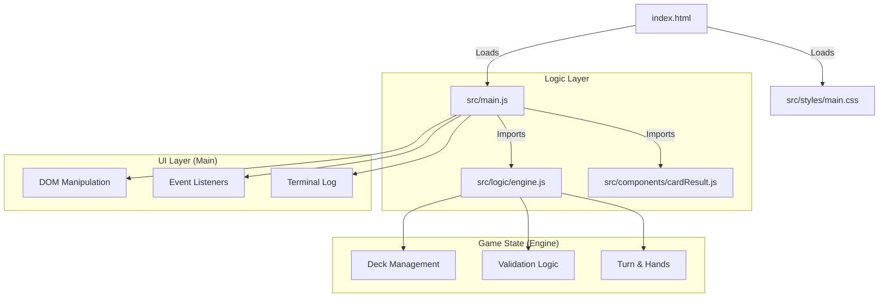

# Mau Mau - Cyberdeck Edition Documentation

## 1. Stack Architecture

The application is built using a **Vanilla JavaScript** stack, emphasizing performance, simplicity, and a retro-futuristic "Cyberdeck" aesthetic.

### **Core Components**

### **File Descriptions**

*   **`index.html`**: The entry point. Implements a split-screen "Cyberdeck" layout.
    *   **Left Panel**: Game Board (Table, Hands, Draw/Discard piles).
    *   **Right Panel**: System Console (Status, Log, Input Matrix).
*   **`src/main.js`**: The Game Controller.
    *   Handles UI interactions (clicks, hover effects).
    *   Manages the "View" logic (animations, modals, logging).
    *   Bridges the player's actions to the Engine.
*   **`src/logic/engine.js`**: The pure Game Engine.
    *   **State Management**: Tracks hands, deck, current player.
    *   **Rules Engine**: Validates moves (Suit matching, Special cards).
    *   **Deck**: Managed ensuring 32 unique cards.
*   **`src/components/cardResult.js`**:
    *   Generates the SVG HTML for each card dynamically.
    *   Contains the ASCII art assets for card symbols.
*   **`src/styles/main.css`**:
    *   Implements the **Tokyo Night** color scheme.
    *   Uses Flexbox for the responsive Cyberdeck layout.
    *   Contains Glitch effects and CRT scanline animations.

---

## 2. Game Rules (Mau Mau)

The game follows standard Mau Mau rules using a **32-card Skat deck**.

### **Basic Gameplay**
*   **Goal**: Be the first to discard all your cards.
*   **Turn**: Play a card that matches the **Suit** or **Value** of the top discard card.
*   **Draw**: If you cannot play, you must draw a card (or click the draw deck).

### **Special Cards**
*   **7 (Seven)**: The next player must draw **2 cards**, unless they can play another 7 on top (stacking the penalty).
*   **8 (Eight)**: The next player is **skipped**.
*   **Jack (Bube)**:
    *   Can be played on **any** card (except another Jack in some variants, this implementation forbids Jack on Jack).
    *   Allows the player to **wish for a suit**. The next player must play that suit.
    *   *Start Rule*: If the game starts with a Jack, the starting player chooses the suit immediately.
*   **Mau Rule**:
    *   Before playing your **second to last card** (so you have 1 left after play), you must say "Mau".
    *   **Implementation**: Click the **MAU** button *before* playing your card.
    *   **Penalty**: If you forget, there is a chance the "System" catches you, forcing you to draw penalty cards.

---

## 3. UI Elements

### **The Cyberdeck Console**
*   **Status**: Displays current turn and active wishes.
*   **Terminal**: A scrolling log of all game events.
    *   *Human events* are neutral.
    *   *Attacks (7)* are highlighted in **Red**.
    *   *System alerts* are Amber/Orange.
*   **Wish Matrix**: A dedicated control panel on the right used to select suits when playing a Jack.

### **The "Mau" Button**
*   Located on the table.
*   **Interactive**: Click it to toggle the "Mau" state.
*   **Feedback**: Logs "Human says: MAU!" to the terminal.
