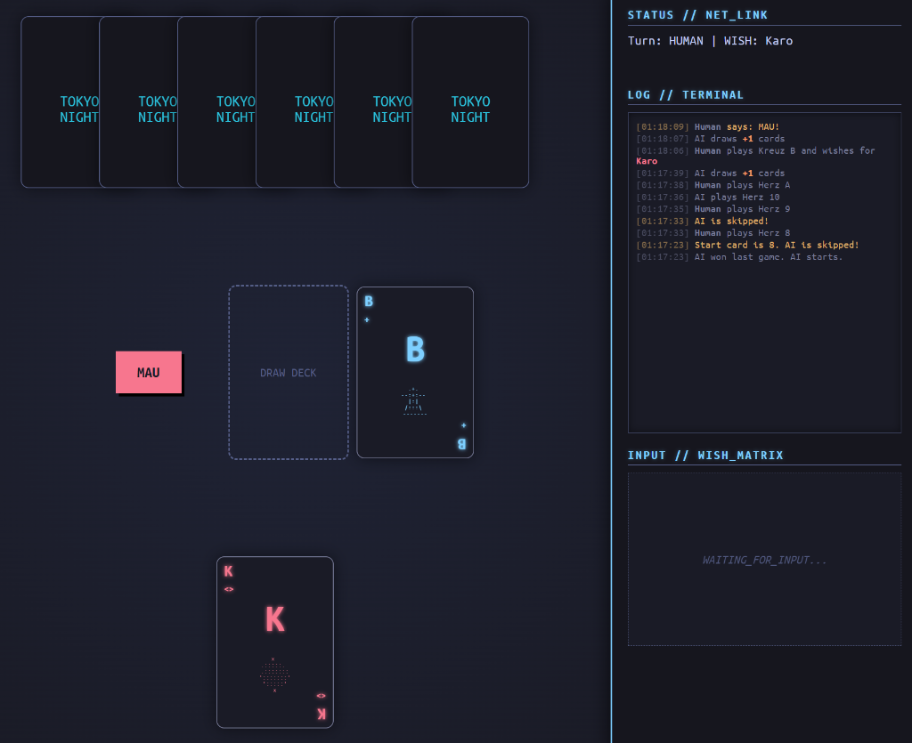

# Mau Mau - Cyberdeck Edition



A web-based **Mau Mau** card game featuring a high-fidelity **Cyberpunk / Tokyo Night** aesthetic.

## 🚀 Essentials

*   **Playable**: Human vs AI.
*   **Tech Stack**: Vanilla JS, HTML5, CSS3. No frameworks.
*   **Theme**: Cyberdeck interface with CRT effects and ASCII art cards.

## 🎮 Key Features

*   **Split-Layout Interface**: "Game Board" for play, "Side Deck" for logs and controls.
*   **Fully Interactive**: Drag/Drop simulation via clicks, animated cards.
*   **Smart Rules Engine**: Handles 7-stacking, 8-skip, and Jack-wishes (including Start-Jack rules).
*   **Mau Mechanic**: Don't forget to click the **MAU** button before your last card, or face the penalties!

## 📖 Documentation

For detailed architecture diagrams and full game rules, please see [DOCUMENTATION.md](./DOCUMENTATION.md).

## 🛠️ Setup

1.  Clone the repository.
2.  Open `index.html` in any modern browser.
3.  (Optional) Run a local server for best module support:
    ```bash
    python3 -m http.server 8080
    ```
