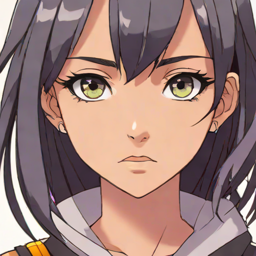

# Naruto Talker

An AI-powered application that brings characters to life. It generates a character portrait from text, synthesizes a voice, and animates the face to speak your script.

## Technical Documentation
For detailed architecture, model specifications, and configuration parameters, please refer to the [Technical Documentation](documentation.md).

## Usage
Run the application using the headless pipeline script or the Gradio UI:

```bash
python app.py
```

## Example Output
Here are sample results from the pipeline (Run ID: 1769280970).

### Generated Portrait


### Final Video (Click to download/watch)

[](https://raw.githubusercontent.com/HeikoKramer/ai-lab/main/naruto_talker/outputs/run_1769280970/final_restored.mp4)


### Silent Animation (Click to download/watch)

[](https://raw.githubusercontent.com/HeikoKramer/ai-lab/main/naruto_talker/outputs/run_1769280970/silent.mp4)


## Requirements
- Python 3.10+
- CUDA-enabled GPU (recommended)
- See `requirements.txt` for dependencies.
